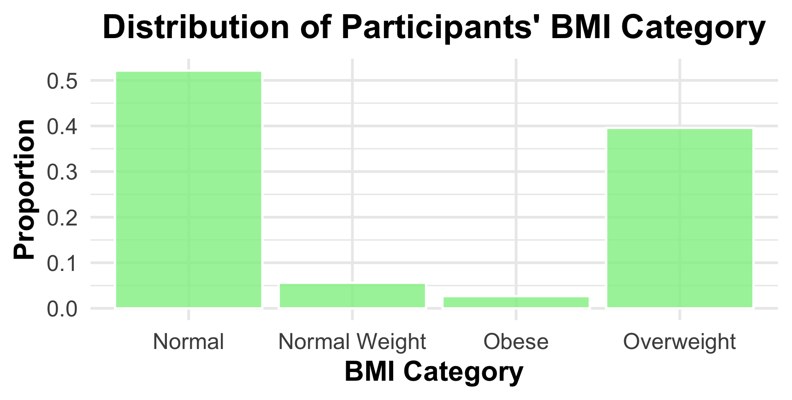
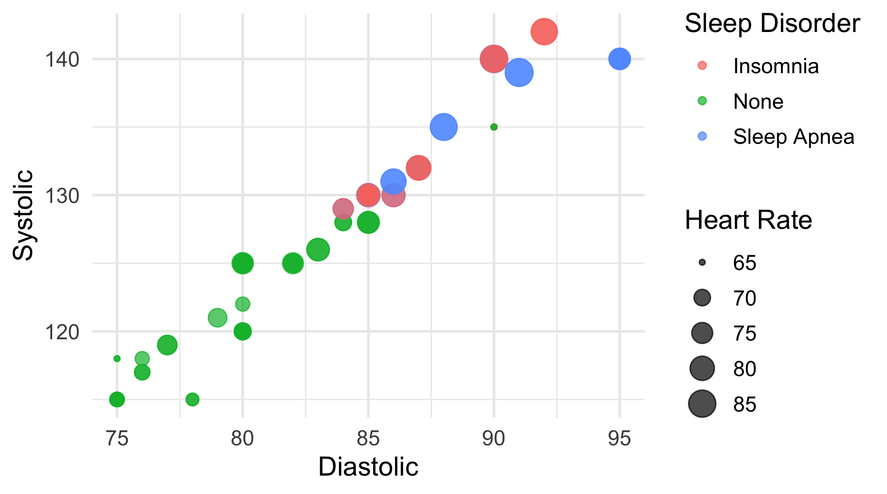

# 💤 Sleep, Health, and Lifestyle Analysis

This project analyzes how various health and lifestyle factors affect sleep quality and disorders using data visualization and statistical techniques in **R**. The goal is to demonstrate a clear and thorough data science process, including preprocessing, exploratory data analysis (EDA), and multivariate insights.

---

## 📁 Dataset

**Source**: [Sleep Health and Lifestyle Dataset](https://www.kaggle.com/datasets/uom190346a/sleep-health-and-lifestyle-dataset) (Kaggle)  
**Size**: 374 records of adults  
**Features** include:
- Age, Gender, BMI Category
- Sleep Duration, Quality of Sleep, Sleep Disorder
- Stress Level, Physical Activity, Daily Steps
- Blood Pressure, Heart Rate

## ⚙️ 1. Data Preprocessing

- Converted `Blood Pressure` into `Systolic` and `Diastolic` columns.
- > 💡 **Note**: The `Blood Pressure` column was initially in `'systolic/diastolic'` format and was split into two numeric columns: `Systolic` and `Diastolic`.
- Checked and handled missing values.
- Ensured appropriate data types for each column.

---

## 📊 2. Exploratory Data Analysis (EDA)

### 🔹 Univariate Analysis

- **Age Distribution**  
  Most participants are between 20 and 70 years old.  
  

- **Sleep Duration**  
  Sleep duration mostly ranges between 5 to 9 hours.  
  

- **BMI Categories**  
  Around 50% have normal BMI, and 40% are overweight.  
  

---
### 🔹 Bivariate Analysis

#### Categorical vs Numerical

- **BMI Category vs Sleep Quality**  
  People with normal BMI tend to have better sleep quality.  
  

- **BMI vs Age**  
  Overweight individuals are more likely in the middle-aged group.  
  

#### Numeric vs Numeric

- **Pairplot**  
  To explore pairwise relationships among numeric features.  
  

- **Correlation Matrix**  
  Showed that sleep quality is positively correlated with sleep duration and negatively correlated with stress level.  
  

- **Sleep Duration vs Sleep Quality**  
  Confirmed linear relationship.  
  

---
## 🔺 3. Multivariate Analysis

Explored interactions between 3+ features using colored boxplots and faceted visualizations.

- **Stress Level vs Sleep Duration (by Sleep Disorder)**  
  High stress levels are linked to shorter sleep durations, especially among those with sleep disorders.  
  

- **Blood Pressure & Heart Rate by Sleep Disorder**  
  Participants with sleep disorders generally have elevated blood pressure and heart rate.  
  

- **Daily Steps vs Sleep Quality (by Sleep Disorder)**  
  In insomnia patients, higher daily steps correlated with better sleep quality, unlike those without disorders.  
  

---

## ✅ Key Insights

- Sleep quality improves with longer sleep duration and lower stress levels.
- Overweight and obese individuals report lower sleep quality.
- Sleep disorders are associated with higher heart rate and blood pressure.
- Physical activity seems to help sleep quality for insomnia sufferers.

---

## 📦 Tools Used

- **Language**: R  
- **Libraries**:  
  `ggplot2`, `dplyr`, `tidyr`, `GGally`, `ggcorrplot`, `readr`

---

## 🙏 Acknowledgements

- Dataset: [Sleep Health and Lifestyle Dataset](https://www.kaggle.com/datasets/uom190346a/sleep-health-and-lifestyle-dataset)
- Visualizations were created as part of a personal data science portfolio project in R.

---
