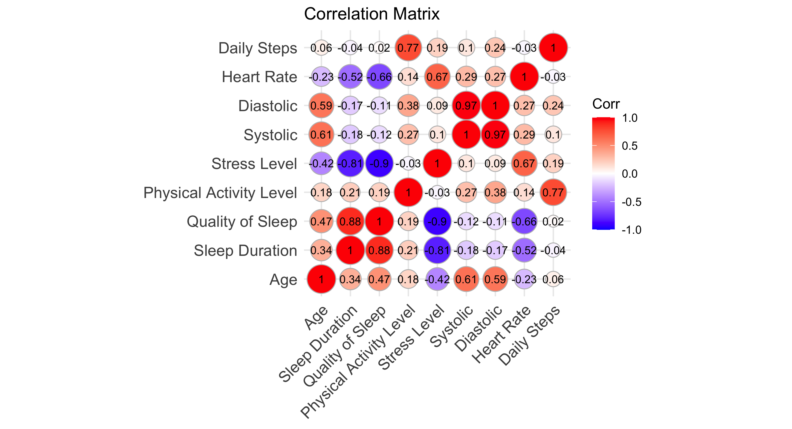
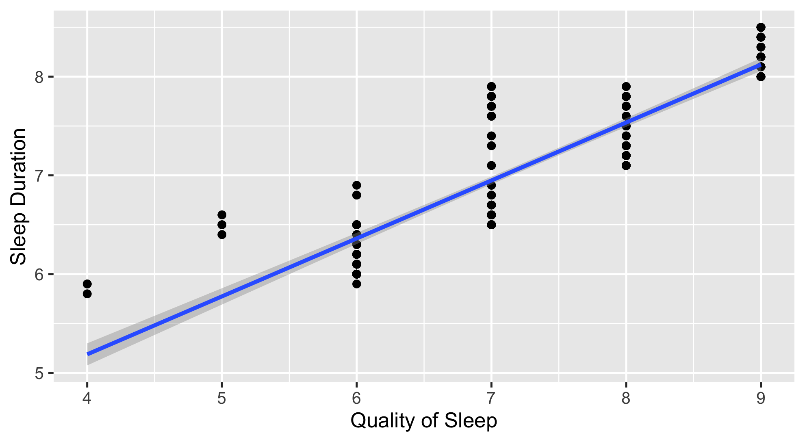

# Sleep-Health-and-Lifestyle

## 1. Preprocessing
In the preprocessing step, I cleaned and prepared the dataset. For example, the "Blood Pressure" column with character inputs like "126/83" was split into systolic and diastolic columns with int values. Missing values were checked and handled appropriately.

# Exploratory Data Analysis (EDA)
## 2. Univariate Analysis
I analyzed the distribution of each feature. For example, the age histogram shows that the participants are ranges between 20 to 70.
 
And sleep duration mostly ranges between 5 to 9 hours. 
 
Categorical features such as sleep disorder and gender are shown in bar charts. For instance, barplots for the BMI shows that almost 50 % of the participants had a normal BMI factor while 40% were overweighted.
 

## 3. Bivariate Analysis
I explored the relationship between different features. 
For categorical parameters: 
The analysis of quality of sleep in each BMI category shows that people with normal BMI factor has a better sleep quality while obese and overweighted people have a lower sleep quality.

Analysis shows that most of the overweighted participants are middle aged(>45 years), normal BMI factor is common in the range of ( 32 to 42).
 

To explore the relationships between numeric features, a correlation matrix was computed. This helped identify potential linear associations between variables such as Age, Sleep Duration, Quality of Sleep, and Physical Activity Level. The matrix provides insight into which features may influence each other and guides the selection of variables for further multivariate analysis or modeling.
 

This plot shows strong correlation between between Sleep quality and Sleep duratio. Moreover it shows high negative correlation between stress level and Sleep duration and quality. To check these more closely, we plot some of the correlated paeameters:
As we might assumed sleep duration and sleep quality have a linear relationship.
 
Higher stress levels were generally associated with shorter sleep durations, especially for those with sleep disorders.

In another diagram, we analysed the effect of daily steps on sleep quality. The results shows that for the group with no sleep disorder, the daily steps does not affect the sleep quality, while for the insomnia participants, higher number of daily steps resulted in better sleep quality.

## 4. Multivariate Analysis
Using multivariate plots, I tried to understand deeper patterns. For example, I used ggpairs to explore the combined effect of stress, blood pressure, and BMI on sleep duration.
